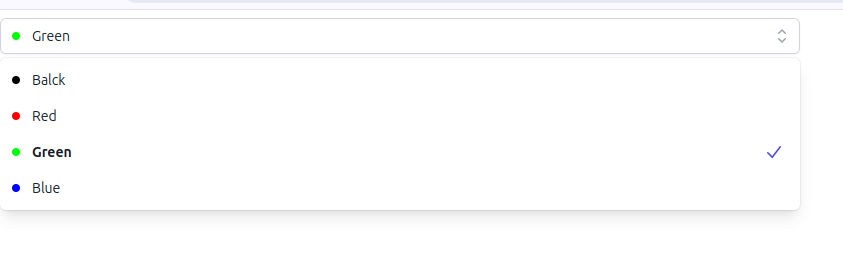

## TM Color Dropdown

### Installation
    npm i -S tm-color-dropdown

### Code

    import React from 'react'
    import { ColorDropdown } from 'tm-color-dropdown'
    import "tm-color-dropdown/dist/style.css";

    function App() {
  return (

      <ColorDropdown
        rangeValues={["#fff", "#ff0000", "#00ff00", "blue", "green"]}
      />
    

  )
}

export default App

### Testing local
#### Run this from package dev env terminal

    npm link

#### Run this from folder when you want to import to

    npm link tm-color-dropdown